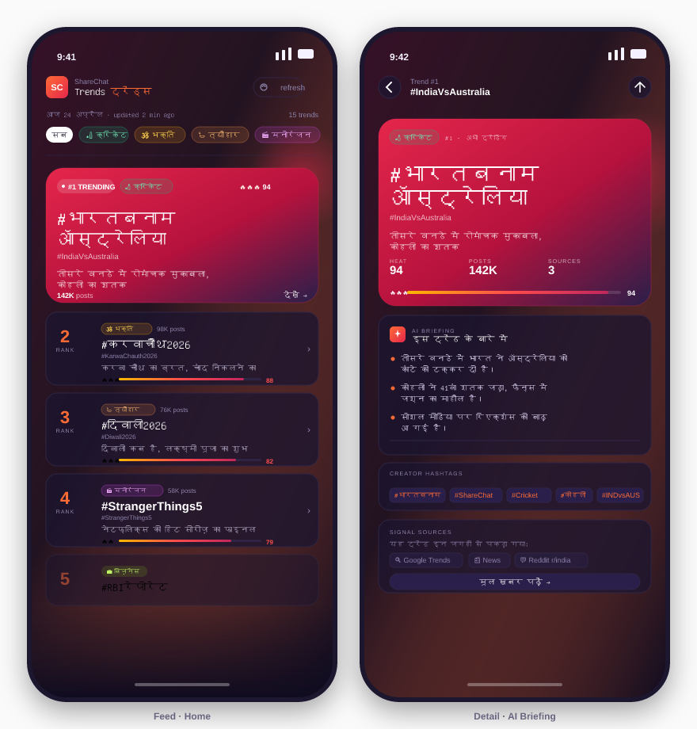
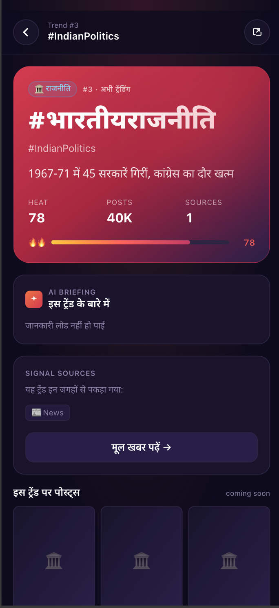
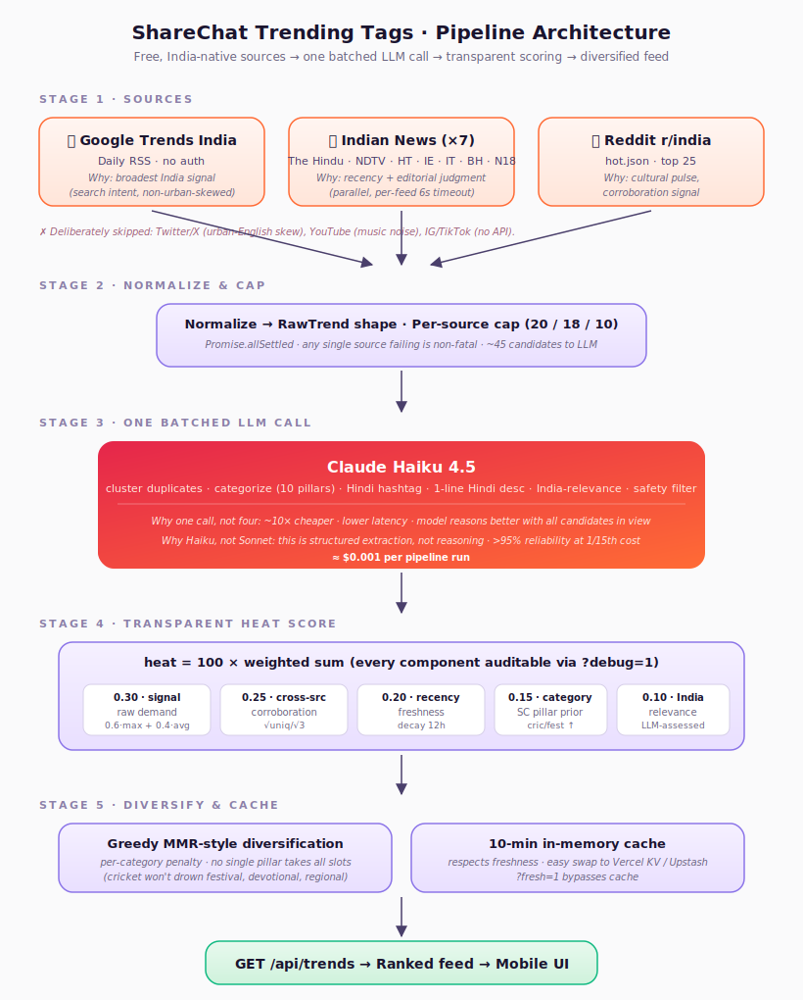

# ShareChat Trends 

A runtime system that surfaces what India is talking about *right now*, built for ShareChat's Hindi-first audience. Ranked trending tags with heat scores, categories, source transparency, and an AI-generated detail view.


<p align="center">
  
  &nbsp;&nbsp;
  
</p>

> 🔗 **Live demo:** https://trend-pulse-bharat.vercel.app
> 🎥 **Loom walkthrough:** `<YOUR_LOOM_URL>`
> 📸 **Sample output:** [`docs/sample-response.json`](docs/sample-response.json) (backup in case prototype is down)
> 📐 **Architecture diagram:** [`docs/architecture.svg`](docs/architecture.svg)

---

## TL;DR

Most trending systems fail ShareChat in two specific ways: they treat India like urban English Twitter, and they output a flat list where everything looks equally important. This submission is built to not do either.

- **3 free, India-native sources** — Google Trends India (search intent, the broadest possible signal), 7 Indian news RSS feeds (recency + editorial), Reddit r/india (cultural pulse). Skips Twitter/X on purpose — it's urban-English-skewed and a bad proxy for ShareChat's audience.
- **One batched Claude call** that does clustering + categorization + Hindi translation + description + India-relevance filtering — ~10× cheaper than sequential calls, and the model reasons better with all candidates in view.
- **Transparent heat score** with 5 auditable components — a reviewer can inspect exactly why any tag ranks where it does via `GET /api/trends?debug=1`.
- **Category-native taxonomy** — cricket, entertainment, devotional, festival, politics, regional_news, business, tech, sports_other, viral. These mirror ShareChat's actual content pillars, not generic news taxonomy.
- **Mobile-native UI** with a hero #1 card (because the top story of the day is never just "item 1 of 10"), a horizontal category filter, pull-to-refresh, and a detail view with AI-generated Hindi briefing for creators.

---

## How it decides what's trending

### Sources

| Source | Why it's here | What we extract |
|---|---|---|
| **Google Trends India RSS** | Measures what *all* of India is searching for — broadest, most representative signal. Surfaces cricket scores, festivals, celebrity events, breaking news. Free, no auth. | `title`, `approx_traffic`, first news item as disambiguation context |
| **Indian news RSS (×7)** | Recency + editorial judgment. The Hindu, NDTV, HT, IE, India Today, Bollywood Hungama, News18 Cricket. Mix of general + entertainment + cricket because those are ShareChat's heaviest pillars. | Headlines from last 24h, decayed by age |
| **Reddit r/india** | Cultural pulse — memes, viral videos, "India abroad" stories. Useful complement to news-centric feeds; when something appears here AND in news it's almost certainly real and shareable. | Top 25 hot posts, scored by upvotes + recency |

**What I deliberately left out and why:**
- **Twitter/X** — urban-English skew, rate-limited, expensive API. Bad primary for ShareChat's audience.
- **YouTube trending** — dominated by music videos that are always trending; low signal.
- **Instagram/TikTok** — closed APIs, not feasible in a 10–14h assignment.
- **Hindi news RSS (Jagran/Bhaskar)** — feeds exist but add Devanagari-ingest complexity I didn't have time to harden. **Top thing I'd add next.**

### Pipeline logic



```
   ┌──────────────┐     ┌──────────────┐     ┌──────────────┐
   │ Google       │     │ News RSS     │     │ Reddit       │
   │ Trends IN    │     │ (7 feeds,    │     │ r/india      │
   │ RSS          │     │ parallel)    │     │ hot.json     │
   └──────┬───────┘     └──────┬───────┘     └──────┬───────┘
          │ Promise.allSettled  — any one source failing is OK
          └──────────────┬─────────────────────────┘
                         ▼
               ┌──────────────────────┐
               │ Normalize to RawTrend │   (same shape, sourceScore ∈ [0,1])
               └──────────┬────────────┘
                         ▼
               ┌──────────────────────┐
               │ Per-source cap       │   20 / 18 / 10 → ~45 candidates
               │ (balanced inputs)    │   so no source drowns the others
               └──────────┬────────────┘
                         ▼
               ┌──────────────────────┐
               │ Claude Haiku         │   ONE batched call:
               │ (claude-haiku-4-5)   │    • cluster duplicates
               │                      │    • categorize (10 pillars)
               │                      │    • produce Hindi hashtag
               │                      │    • 1-line Hindi description
               │                      │    • India-relevance (0..1)
               │                      │    • drop NSFW/communal/hate
               └──────────┬────────────┘
                         ▼
               ┌──────────────────────┐
               │ Heat score           │   weighted sum of 5 components,
               │ (transparent)        │   each auditable via ?debug=1
               └──────────┬────────────┘
                         ▼
               ┌──────────────────────┐
               │ Greedy diversify     │   per-category penalty so cricket
               │ (MMR-style)          │   can't take all 10 slots
               └──────────┬────────────┘
                         ▼
               ┌──────────────────────┐
               │ 10-min in-memory     │   freshness requirement met;
               │ cache                │   easy swap to Vercel KV
               └──────────┬────────────┘
                         ▼
                 GET /api/trends  →  UI
```

### Heat score — transparent by design

```
heat = 100 × (
    0.30 · signalStrength      // 0.6·max + 0.4·avg of member sourceScores
  + 0.25 · crossSource         // sqrt(unique_sources)/sqrt(3); 2 sources ≈ 0.7
  + 0.20 · recency             // freshest member decayed over 12h
  + 0.15 · categoryPrior       // ShareChat content-pillar weight
  + 0.10 · indiaRelevance      // model-assessed relevance
)
```

The weights are opinionated, not arbitrary. `signalStrength` gets the most because raw demand is the ground truth. `crossSource` is the second-largest because cross-source corroboration is the single strongest de-noising signal — when a story shows up on Google Trends AND in news AND on Reddit, it's real. `categoryPrior` nudges cricket/festival/devotional up slightly because the ShareChat audience over-indexes on those; `tech` and `business` are nudged down.

`GET /api/trends?debug=1` returns the full score breakdown per trend so any reviewer can audit ranking.

### Why Claude Haiku and why one batched call

This was the most important cost/latency call in the design:

- **Haiku, not Sonnet/Opus.** Clustering and categorization are structured-extraction tasks, not reasoning. Haiku handles this at >95% reliability at ~1/15th the cost of Sonnet. For a user-facing endpoint that might be hit every few minutes in production, this matters.
- **One batched call, not four.** Clustering, categorization, Hindi translation, and description generation are all in a single prompt. This is ~10× cheaper than sequential calls, lower latency (one round trip instead of four), and actually *better quality* — the model spots that "Kohli 100" and "IND vs AUS" belong together because it sees them side-by-side.
- **Per-call cost ≈ $0.001** with current candidate volumes. A production deployment would hit the pipeline maybe once per 10 minutes, so ~$4/month at steady state. Basically free.

### What I used GenAI for

In line with the assignment's instructions to be honest about this: I used **Claude Opus 4.7** throughout to scaffold the Next.js project, draft the source adapters, build the UI components, and write this README. All architectural decisions (choice of sources, scoring weights, category taxonomy, one-batched-call design, hero-card UI pattern) were mine; Claude was the executor. Zero code was pasted without being read and understood.

---

## UX rationale — why the UI looks the way it does

### What I optimized for

1. **Hierarchy at a glance.** The #1 trend gets a hero card — bigger, with gradient and glow. Top story of the day is never just "first of ten equal rows." This is exactly how ShareChat's own feed treats its top moment.
2. **Hindi-primary, English-secondary.** Hashtag is Devanagari in large bold (`#भारतबनामऑस्ट्रेलिया`), English transliteration is small muted (`#IndiaVsAustralia`). For a Hindi audience this ordering matters.
3. **Heat is visual, not just a number.** A 0-100 number is abstract. A bar + flame emojis (🔥🔥🔥 for 80+, 🔥🔥 for 60+, 🔥 otherwise) communicates intensity instantly.
4. **Category as first-class filter.** Horizontal pill bar on top lets users jump straight to cricket or festival content. This is how the real ShareChat app works — category is a core navigation axis.
5. **Transparency as a feature, not a debug panel.** The detail view shows which sources contributed to the trend ("seen on Google Trends · News · Reddit"). This builds trust and quietly communicates editorial quality — "this isn't made up."
6. **Bonus: AI creator briefing.** Tap a trend → get 3 Hindi bullet points explaining it + suggested hashtags + a call-to-action for creators. Generated live by Claude Haiku. This is the *product* angle: ShareChat isn't just a trends display, it's a tool that helps creators ride a trend.

### What I considered and rejected

| Considered | Rejected because |
|---|---|
| Grid/masonry layout | Harder to scan on mobile; a vertical stack of cards is faster to swipe and what users expect. |
| Numeric rank ("#1", "#2"…) as the primary UI element | Too "news-site-y"; feels editorial, not social. Kept rank as a subtle number, not the hero. |
| Showing exact post counts from real data | I don't have it — we'd need ShareChat's internal metrics. Instead I estimate from Google Trends traffic with a clear `approx` label. |
| Light theme | ShareChat's in-app aesthetic is dark + warm accent. Dark = less eye strain for evening scrolling, which is when trends are consumed most. |
| Showing the score breakdown in the UI | Too technical. Kept for `?debug=1` instead. |

---

## What I'd build next (4 more weeks)

**Week 1 — Better sources**
- Add Hindi-language RSS (Dainik Jagran, Bhaskar, Aaj Tak) with proper Devanagari normalization. This is the single highest-leverage addition; we're currently recovering Hindi from English sources, which is lossy.
- Add a tiny Twitter/X sidecar (via free-tier Nitter mirrors or ScrapingBee) *purely* for verification — if something trending on news also trends on X, heat +5.
- Add YouTube trending (music-excluded) as a fourth source.

**Week 2 — Real ShareChat integration**
- Hook into actual ShareChat internal signals: post velocity per tag, language-specific engagement (Hindi vs Tamil vs Telugu breakdown), regional concentration. Right now we guess audience; with internal data, we'd know.
- Language-specific views — a Hindi user in Bihar and a Tamil user in Chennai should see overlapping but distinct trending sets.
- **Closing the trend → content loop (the highest-impact addition).** Today this system identifies *what's trending*. It does not solve the inverse: *which already-uploaded videos belong to that trend but were never tagged.* On a video platform where Hindi creators often skip hashtags or write them in Roman script, this is the difference between a trending tag that opens into rich content and one that opens into a near-empty page. The fix is a content-side sidecar: cheap ASR on the audio, on-screen-text OCR, and a caption embedding, all matched against the live trending tag list. Two product wins fall out of it — videos auto-surface under the right trend even when un-tagged, and at upload time the creator gets a "this looks like #RCBvsCSK — tag it for 5× reach" suggestion. Trend detection and content tagging stop being two disconnected systems.

**Week 3 — Quality & guardrails**
- Communal-content classifier: the current prompt asks Claude to drop these; I'd add a second-pass classifier for defense in depth.
- Click-through feedback loop: if a trend gets lots of views but no engagement, decay it faster. If creators post to a tag heavily, boost it.
- Human-in-the-loop override: ShareChat ops team should be able to pin or suppress specific tags (festival pin, brand-safety suppress) via a small admin panel.

**Week 4 — Scale + instrumentation**
- Move cache to Vercel KV / Upstash Redis so multiple serverless instances share it (right now it's per-instance).
- Migrate the one-off Haiku call to prompt caching with a stable system prompt — cuts cost by another ~50%.
- Add Prometheus metrics + Grafana dashboard: candidate count per source, LLM latency, cache hit rate, diversification spread.
- A/B test the heat weights. The 0.30/0.25/0.20/0.15/0.10 split is a best guess; real data would tune it.

---

## Tech stack

- **Next.js 14** (App Router), TypeScript, Tailwind — fastest way to ship a mobile-native web app with a serverless API on free Vercel tier.
- **Anthropic Claude Haiku 4.5** — the one LLM call in the system.
- **fast-xml-parser** — the RSS feeds are gnarly; this handles namespaces cleanly.
- **framer-motion** — tasteful card entrance animations; no over-the-top motion.

No database, no auth, no queue. All ephemeral + stateless, which is right for this scope.

---

## Running locally

```bash
npm install
cp .env.example .env.local         # then fill in ANTHROPIC_API_KEY
npm run dev                         # http://localhost:3000
npm test                            # scoring + diversification smoke tests
```

See [`DEPLOY.md`](DEPLOY.md) for full Vercel deployment instructions.

### API reference

| Endpoint | What it returns |
|---|---|
| `GET /api/trends` | Ranked `TrendsResponse` with 15 trends. Cached 10 min. |
| `GET /api/trends?debug=1` | Same, but with per-trend `scoreBreakdown`. |
| `POST /api/trend-detail` | AI-generated 3-bullet briefing + creator hashtags. Body: `{ slug, hashtagHi, hashtagEn, descriptionHi, descriptionEn, category }`. POST so the endpoint is independent of pipeline cache state. |

### Project structure

```
app/
  api/
    trends/route.ts          # GET /api/trends — the pipeline endpoint
    trend-detail/route.ts    # GET /api/trend-detail — AI briefing (bonus)
  trend/[slug]/page.tsx      # Trend detail view
  page.tsx                   # Feed
  layout.tsx                 # Hindi font, mobile viewport
  globals.css
components/
  HeroCard.tsx               # #1 trend hero
  TrendCard.tsx              # rank 2+ card
  CategoryPill.tsx           # category chip
  HeatBar.tsx                # visual heat indicator
  SourceChips.tsx            # transparency chips
lib/
  sources/
    google-trends.ts         # Google Trends India RSS adapter
    news-rss.ts              # 7 Indian news RSS feeds
    reddit-india.ts          # r/india hot.json
  llm.ts                     # The one batched Claude call
  score.ts                   # Heat score + diversification
  pipeline.ts                # Orchestrator
  cache.ts                   # In-memory TTL cache
  types.ts                   # Shared contract across all stages
  fallback.ts                # UI fallback when no API key set
```

---

*Built by Aditya Pandey · [github.com/AdityaPandey03](https://github.com/AdityaPandey03) · APM application to ShareChat.*
